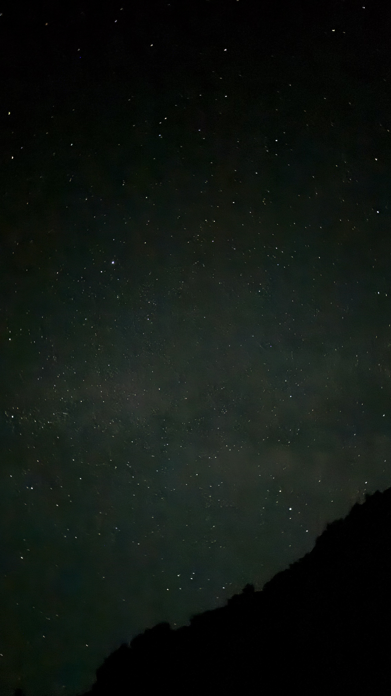

# Exploring the Meaning of Life: Insights from *The Hitchhiker’s Guide to the Galaxy*, *Mr. Nobody*, and *Forrest Gump*

What is the meaning of life? This question has inspired countless stories, debates, and moments of introspection throughout human history. While there’s no single answer, some of the most memorable works of fiction offer profound perspectives that can guide us as we navigate our own journeys. Let’s dive into three iconic pieces of storytelling—*The Hitchhiker’s Guide to the Galaxy*, *Mr. Nobody*, and *Forrest Gump*—to explore the wisdom they share about life, the universe, and everything.

---

## **42: The Absurd Wisdom of *The Hitchhiker’s Guide to the Galaxy***

Douglas Adams’ *The Hitchhiker’s Guide to the Galaxy* famously presents the number **42** as "the answer to the ultimate question of life, the universe, and everything." The catch? The question itself is unknown, leaving the characters—and us—to ponder its meaning.

Adams humorously suggests that life’s great mysteries might not have a single, grand solution. Instead, meaning is found in the journey of exploration, curiosity, and connection. As absurd as 42 may seem, its simplicity reminds us not to take life too seriously. Sometimes, the beauty of existence lies in embracing the chaos, enjoying the ride, and maybe asking, *“What’s for lunch?”*

---

## **“Every Path is the Right Path”: Lessons from *Mr. Nobody***

The movie *Mr. Nobody* takes the idea of life’s possibilities to a whole new level. It explores the infinite outcomes of every choice, showing us that:

> *“Every path is the right path. Everything could have been anything else. And it would have just as much meaning.”*

This powerful statement reminds us that life’s meaning isn’t inherent in the choices we make but in the experiences and emotions we bring to those choices. Whether we take one road or another, the journey is what gives life its richness and depth. Instead of fearing the “wrong” decision, *Mr. Nobody* encourages us to embrace the limitless potential of existence and trust that every path has value.

---

## **“Maybe Both is Happening at the Same Time”: Wisdom from *Forrest Gump***

In *Forrest Gump*, the titular character reflects on whether life is shaped by destiny or chance:

> *“I don’t know if Momma was right or if, if it’s Lieutenant Dan. I don’t know if we each have a destiny, or if we’re all just floating around accidental-like on a breeze, but I, I think maybe it’s both. Maybe both is happening at the same time.”*

This simple yet profound realization captures the duality of life. Some events may feel predestined, while others seem entirely random. Forrest’s brilliance lies in his ability to flow with life’s breeze, fully embracing each moment with openness and authenticity. By accepting the interplay between fate and free will, Forrest teaches us to live with gratitude and to find joy in the unexpected.

---

## **Finding Meaning in the Journey**

From the absurdity of *The Hitchhiker’s Guide to the Galaxy* to the existential depth of *Mr. Nobody* and the heartfelt wisdom of *Forrest Gump*, these stories remind us of one essential truth: **the meaning of life isn’t found in a single answer but in the journey itself.**

Whether we’re calculating answers like Deep Thought, contemplating infinite possibilities like Nemo, or floating through life like Forrest, the key is to embrace the present moment. Life’s meaning is not about having all the answers—it’s about how we live, love, and experience the world around us.

So, perhaps the Ultimate Question is something as simple and profound as: *“What’s for lunch?”*

What do you think? Is life guided by fate, choice, or something in between? Let me know your thoughts in the comments below!

---

*“Every path is the right path.”* Remember that as you walk through life, and savor the journey.