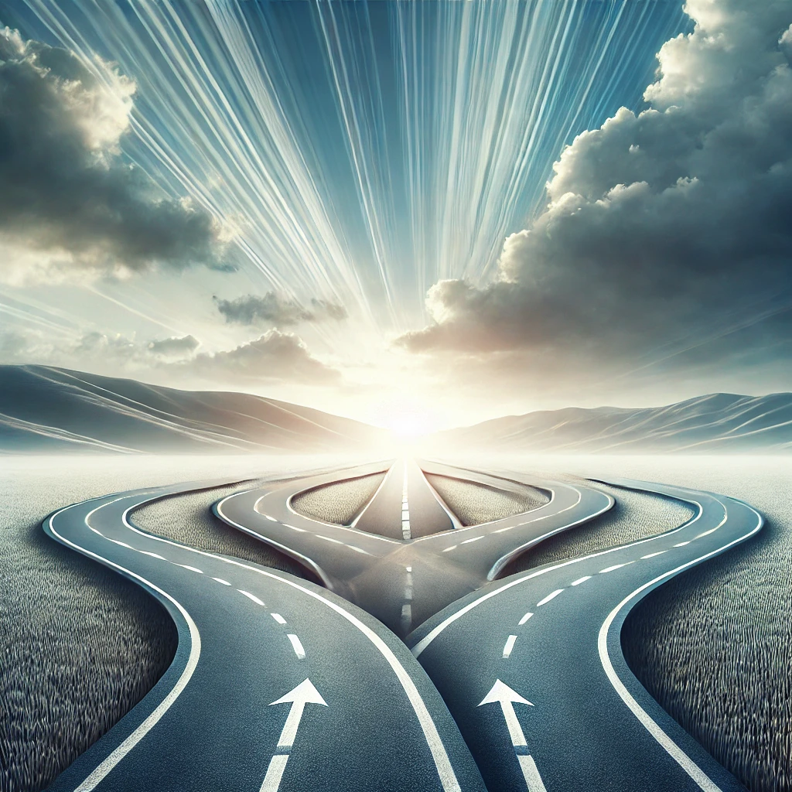

## The Balance Between Vision and Flexibility

Having a clear vision of what you want to accomplish can be powerful. It provides direction, a sense of purpose, and a guiding light through uncertain times. But lately, I've come to understand that it's okay not to always have a perfectly defined picture of the future. Sometimes, living fully in the present moment is just as important.

For a long time, I believed that having a detailed plan was essential for success. However, I began to question this belief: what if it's actually okay not to have everything figured out? What if, instead of sticking to a fixed path, I allowed myself to stay open and flexible?

When we let go of the need to define one particular outcome, we create space to explore, adapt, and discover opportunities that we might otherwise miss. Sometimes, defining our goals too narrowly can set boundaries that limit our growth.

Flexibility means growth. It means embracing change, taking on what comes, and allowing ourselves to shape our path as we move forward. Setting rigid boundaries can prevent us from seeing the potential in unexpected places.

I've realized the value of thinking in opposites—questioning my original beliefs and embracing the possibility that the opposite might also hold truth. This kind of opposite thinking has given me the freedom to see multiple possibilities for my future. In a way, it's like living in a matrix where different possibilities intersect and shape our experiences.

This idea of openness aligns with teachings from Buddhism and Laozi's philosophy. In Buddhism, there is a concept of 'setting a circle,' which involves cultivating an internal environment that nurtures qualities like mindfulness, compassion, and peace. Unlike desires or wants, which often focus on external outcomes and can lead to suffering, setting a circle is about creating a balanced, intentional mindset without attachment. It’s about nurturing growth without clinging to specific results.

Buddhism teaches the value of non-attachment—letting go of rigid expectations and accepting things as they are. By not clinging to fixed visions, we allow ourselves to experience life more fully and with less suffering. Similarly, Laozi's Taoism emphasizes being like water—flowing naturally, adapting to the environment while retaining one's essence. The Taoist principle of wu wei, or effortless action, is about not trying to define rigid standards or outcomes. Instead, it encourages us to let things unfold naturally, leading to individual freedom.

I've learned to balance having a clear vision with the beauty of living fully in the present, without needing to know exactly where I will end up. There's something magical about being open to the unknown—trusting that by living fully in each moment, I am still moving toward something meaningful, even if I can't define it yet.

Maybe, for now, that openness itself is enough.