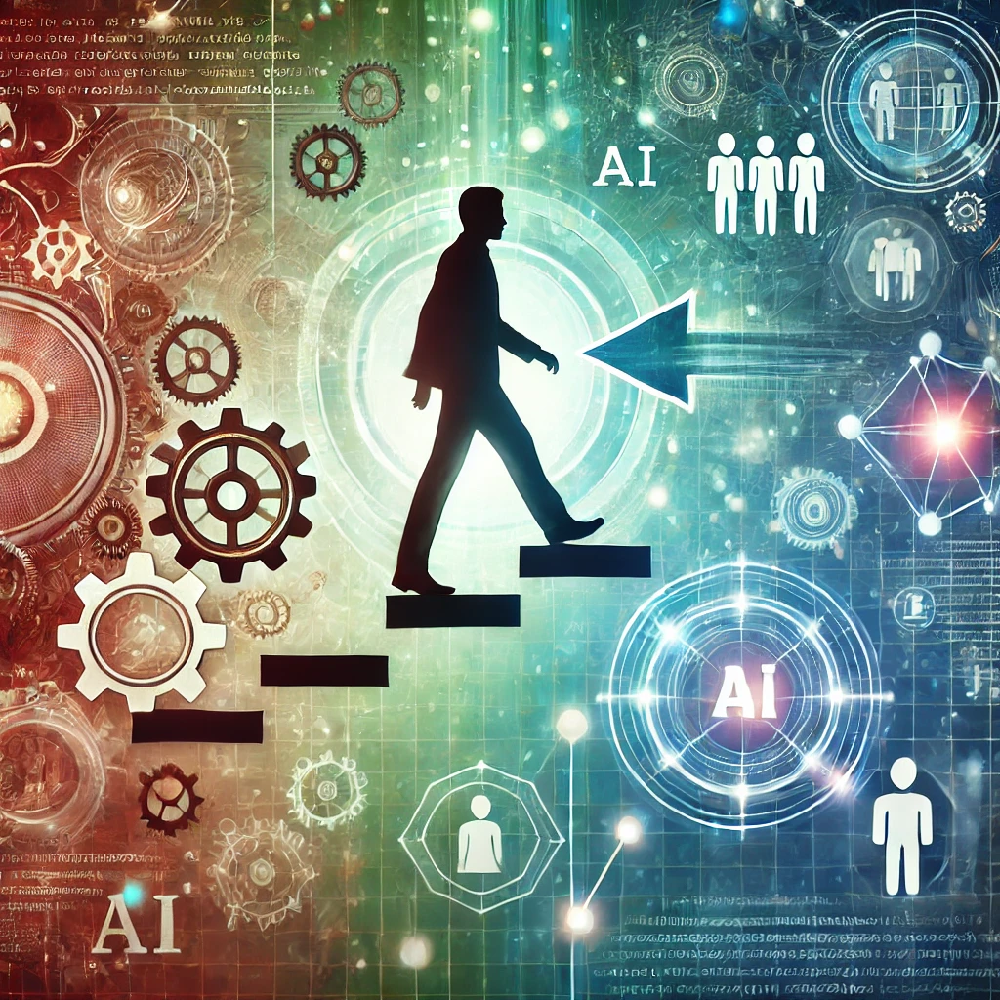

# Preparing for a Career Transition in the AI Era

As the landscape of technology evolves with AI and automation, many professionals feel the need to upskill and explore new career paths. If you’re looking to transition from your current role and stay relevant in this fast-paced world, here are practical steps to guide you:

### 1. Certifications and Courses
Based on the career paths you are interested in, consider the following learning platforms and certifications to help you build your skills:

#### **For Automation/AI Roles:**
- **Coursera**: [AI for Everyone](https://www.coursera.org/learn/ai-for-everyone), [Introduction to Machine Learning](https://www.coursera.org/learn/machine-learning)

#### **For Project Management:**
- **Coursera**: [Project Management Principles](https://www.coursera.org/learn/project-management)

---

### 2. Networking and Mentorship

If you're looking to transition into a different role, networking will be essential. Here's how to get started:

- **Join Industry Communities**: Participate in online forums, LinkedIn groups, or professional communities in your field of interest, such as product management, AI in industrial settings, or automation. Engaging in these groups can help you connect with professionals and learn about potential opportunities.
  
- **Seek Mentors**: Identify mentors within your company or industry who have the kind of roles you aspire to. Ask them how they navigated their own career transitions, and learn from their insights and experiences.

- **Attend Conferences and Webinars**: Whether virtual or in-person, attend events where industry experts gather. This will keep you informed on new trends and give you the chance to meet people who can offer advice or even career opportunities.

---

### 3. Create a Transition Plan

Developing a clear, step-by-step transition plan will help you move into your desired role more smoothly. Here's an example breakdown:

#### **Short-Term Goals (Next 3-6 Months):**
- Complete relevant courses and certifications.
- Start building a portfolio of your work, especially focusing on technical or leadership skills.
- Expand your network and begin reaching out to people in your field of interest.

#### **Mid-Term Goals (6-12 Months):**
- Apply for roles that align with your new skills and interests.
- Take on new responsibilities in your current role that match your future goals (e.g., managing a project, leading a small team, or learning about automation systems).
- Update your resume and LinkedIn to reflect your newly acquired skills and the direction you're moving in.

#### **Long-Term Goals (12-24 Months):**
- Transition fully into your new role, either within your current company or by moving to a new company that better aligns with your career aspirations.

---

### 4. Side Projects and Portfolio Building

As you prepare for this career transition, start working on small side projects or case studies that are relevant to the roles you’re aiming for. Some examples include:

- **For AI/Automation Roles**: Create automation or AI-related projects using Python and GitHub to demonstrate your technical skills.
  
- **For Product Management or Leadership Roles**: Participate in collaborative projects where you can practice product lifecycle management. Alternatively, volunteer for leadership roles in smaller initiatives to develop and demonstrate your management skills.

---

### Final Thoughts

By gradually building your skills and expanding your network, you will be well-positioned to transition into a role that aligns with your goals and the future of technology. The key is to keep learning, stay adaptable, and leverage the power of networking and mentorship to guide your way.

---

Do you have experience with transitioning into new roles? What steps have you found most effective in making a successful career shift? Share your thoughts below!
