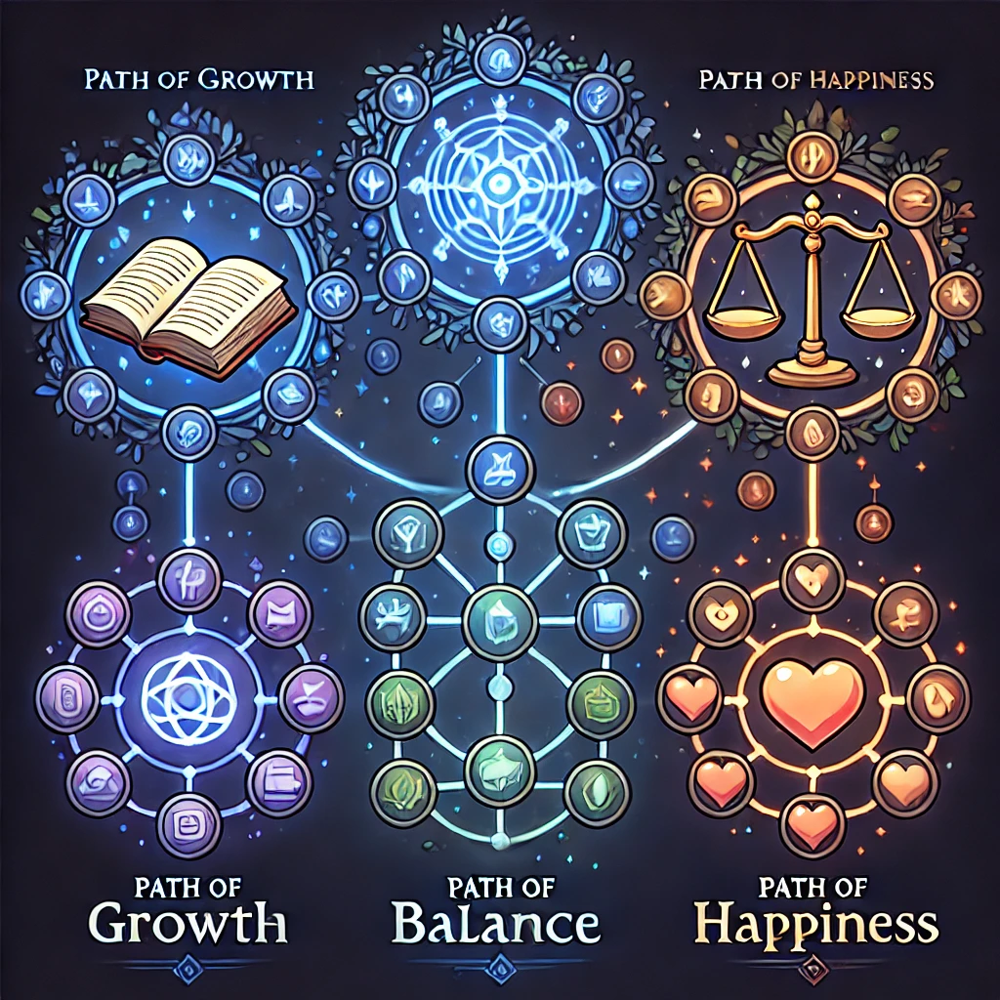
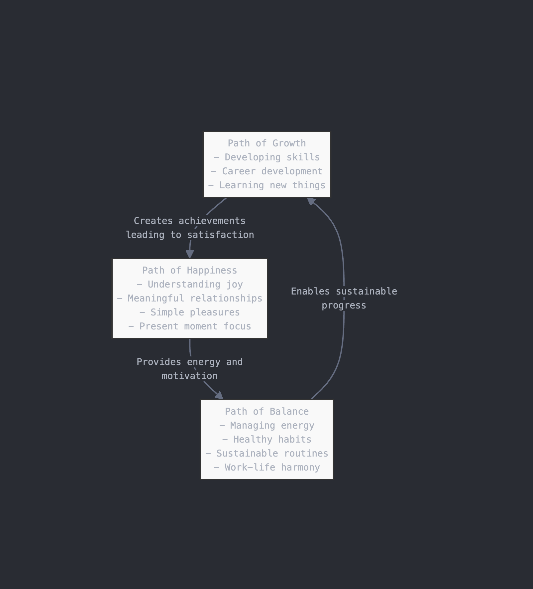

# Main Quests

## "Path of Growth" Quest  
- Developing skills and knowledge
- Career development
- Learning new things  

## "Path of Balance" Quest  
- Managing energy levels  
- Building healthy habits  
- Finding sustainable routines  
- Work-life harmony  

## "Path of Happiness" Quest  
- Understanding what brings you joy  
- Building meaningful relationships  
- Enjoying simple pleasures  
- Creating moments of contentment
- Embracing the present moment (because it can't be saved)

---

I like how these three paths complement each other:  

- **Growth** keeps you moving forward  
- **Balance** keeps you stable  
- **Happiness** gives meaning to both  

Just like in a game, progress in one path often unlocks achievements in others. For example:  

- Better **balance** (like good rest) helps you grow faster  
- **Growth** often leads to moments of happiness  
- **Happiness** gives you energy for maintaining balance  

---
[life-paths.mermaid](media/life-paths.mermaid)

## Understanding Sub-Quests

While the main paths (원) remain until death, sub-quests are temporary:

**Nature of Sub-Quests:**
- Appear and disappear naturally
- Can be completed or become irrelevant
- Change with circumstances
- Serve the main paths but aren't permanent

**Examples of Sub-Quests:**
- Learning English (Growth Path)
- Starting a meditation practice (Balance Path)
- Building a specific relationship (Happiness Path)

## Approaching Your Quests

**Main Paths (원):**
- Treat them as lifelong companions
- Use them as guidance for decisions
- Don't expect completion
- Find peace in their ongoing nature

**Sub-Quests:**
- Approach with dedication but without attachment
- Be willing to adjust or abandon as circumstances change
- Celebrate completion without clinging
- Use them as stepping stones on your main paths

## Daily Practice

While the paths are eternal, our engagement with them happens in the present:

1. **Regular Reflection:**
   - How are your current sub-quests serving your main paths?
   - Are you maintaining balance among the three paths?
   - What new sub-quests might be emerging?

2. **Mindful Choices:**
   - Consider how daily decisions affect each path
   - Look for opportunities to serve multiple paths
   - Stay flexible in your approach

3. **Gentle Awareness:**
   - Notice when you're over-attached to sub-quests
   - Remember the permanent nature of the main paths
   - Find peace in the journey itself

Remember: These paths are like rivers flowing until the end of life, while sub-quests are like the boats we use to cross at different points. The boats are temporary, but the rivers remain.

