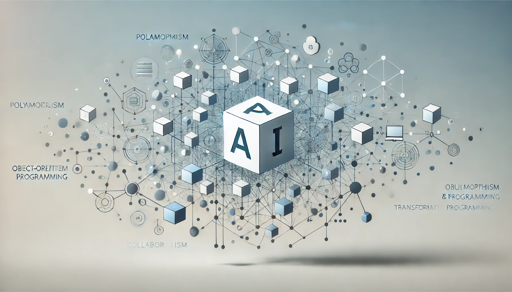

# The AI Revolution Through an OOP Lens: Understanding and Preparing for the Future of Work

In today's rapidly evolving technological landscape, artificial intelligence stands at the forefront of what many experts call the Fourth Industrial Revolution. As software increasingly reshapes our world, understanding this transformation becomes crucial for career planning and professional development. By examining the AI revolution through multiple perspectives—both its broad socioeconomic impact and the metaphorical framework of object-oriented programming—we can gain deeper insights into what lies ahead.

## Historical Technological Revolutions: An OOP Perspective

Throughout history, major technological revolutions have transformed how humans work. Viewing these shifts through object-oriented programming concepts offers enlightening parallels:

### The Agricultural Revolution: Base Class Instantiation

```python
class HumanWork:
    def __init__(self):
        self.location = "nomadic"
        self.output_scale = "subsistence"
        self.specialization = "generalist"
```

The Agricultural Revolution created the first significant "instance" of organized human work, establishing patterns that would persist for millennia:

```python
class AgriculturalWork(HumanWork):
    def __init__(self):
        super().__init__()
        self.location = "settled"
        self.output_scale = "surplus"
        self.specialization = "seasonal_roles"
```

### The Industrial Revolution: Factory Method Pattern

The Industrial Revolution implemented what in OOP we'd recognize as the Factory Method pattern, standardizing the production of work outputs:

```python
class IndustrialProduction:
    def create_worker(self):
        worker = FactoryWorker()
        worker.assign_specific_task()
        worker.standardize_output()
        return worker
```

This transition replaced artisanal approaches with systematic, repeatable processes—creating specialized worker "instances" with consistent behaviors.

### The Information Age: Modular Inheritance

The rise of computers introduced modular knowledge work that mirrors inheritance hierarchies:

```python
class KnowledgeWorker(Worker):
    def __init__(self):
        super().__init__()
        self.tools = ["computer", "software", "information"]
    
    def process_information(self):
        # Abstract method implemented differently by subclasses
        pass

class Programmer(KnowledgeWorker):
    def process_information(self):
        return self.write_code()
        
class Analyst(KnowledgeWorker):
    def process_information(self):
        return self.analyze_data()
```

### The AI Revolution: Runtime Polymorphism

What distinguishes the current AI revolution is its implementation of runtime polymorphism—the ability to change behaviors without changing the interface:

```python
class ModernWork:
    def __init__(self, intelligence_provider):
        self.intelligence = intelligence_provider
    
    def solve_problem(self, problem):
        return self.intelligence.process(problem)
```

The intelligence provider can be dynamically swapped between human and AI implementations, often without restructuring the overall system:

```python
# Previously:
work_system = ModernWork(HumanIntelligence())

# Increasingly:
work_system = ModernWork(ArtificialIntelligence())
```

This unprecedented flexibility is why the AI transformation differs from previous revolutions. Earlier transitions required physical infrastructure changes and generational timescales. The AI revolution simply requires a "runtime swap" of the intelligence provider, which can happen with minimal visible system changes and occur within years rather than decades.

## The Fundamental Nature of AI-Driven Job Transformation

Unlike previous technological revolutions, the AI transition is happening at unprecedented speed. According to venture capitalists working closely with AI startups, we're witnessing not a gradual evolution but a fundamental transformation of work itself.

What's particularly counterintuitive is which jobs face the greatest initial disruption:

> "It's actually not manufacturing jobs that will go first... manufacturing jobs require robotic advancements which are much slower than software machine learning."

Instead, routine jobs across various sectors appear most vulnerable to automation through pure software solutions. Companies are already developing algorithms that outperform humans in customer service, telemarketing, loan approvals, and portfolio management.

Technical feasibility studies suggest that within 10-15 years, AI algorithms could potentially perform tasks for approximately 50% of current human jobs. While this doesn't necessarily translate directly to a 50% unemployment rate, it does highlight the ceiling of potential impact.

## Limitations of the OOP Metaphor: Where the Analogy Breaks Down

Before proceeding further, we must acknowledge where our object-oriented programming metaphor proves insufficient:

1. **Complex Systems vs. Clean Abstractions**: While OOP encourages clean abstractions with well-defined boundaries, real economies feature messy interdependencies. A customer service representative isn't just executing predefined methods but participating in complex social systems that resist simple modeling.

2. **Human Adaptability**: Unlike objects whose behaviors are defined by their class, humans continuously adapt. Consider this Python code that fails to capture human reality:

   ```python
   # This would be accurate in OOP but not for humans:
   class JobRole:
       def __init__(self, skills):
           self.skills = skills
           # In reality, humans continuously adapt their skills
           # self.skills = self.continuously_evolve(skills)
   ```

3. **Physical vs. Digital Constraints**: Our metaphor understates the significant differences between software and physical reality. AI can instantly replace a digital process, but robots replacing physical tasks face material constraints:

   ```python
   class DigitalAutomation:
       deployment_time = "days_to_weeks"
       scaling_constraints = "minimal"
        
   class PhysicalAutomation:
       deployment_time = "months_to_years"
       scaling_constraints = "significant"
       # Affected by: materials, physics, safety, infrastructure
   ```

4. **Socioeconomic Complexity**: The transition isn't purely technological but is shaped by policy, culture, and power dynamics—factors our OOP metaphor struggles to represent.

By acknowledging these limitations, we can use the OOP perspective as one valuable lens while recognizing the need for complementary frameworks.

## Object-Oriented Programming: A Framework for Understanding Job Evolution

With those caveats in mind, OOP still offers valuable insights into how job roles are evolving:

### Classes, Inheritance and Overriding

Traditional job categories can be viewed as classes with defined attributes and methods:

```python
class TraditionalJob:
    def __init__(self):
        self.job_title = ""
        self.routine_tasks = []
        self.creative_elements = []
    
    def perform_work(self):
        # Implementation of standard work procedures
        pass
```

When AI enters the equation, it effectively creates a subclass that inherits many properties but overrides key methods:

```python
class AIAugmentedJob(TraditionalJob):
    def __init__(self):
        super().__init__()
        self.algorithm = Algorithm()
    
    def perform_work(self):
        # AI handles routine tasks
        self.algorithm.execute_routine_tasks(self.routine_tasks)
        # Human focuses on creative elements
        self.handle_creative_elements()
```

This inheritance pattern explains why jobs aren't simply disappearing but rather transforming. The base functionality remains, but the implementation changes dramatically.

### Encapsulation: The Protection of Human Expertise

Jobs that strongly encapsulate human expertise—where the "data" and "methods" are deeply integrated with human experience—remain most resistant to AI disruption:

```python
class CaregivingProfessional:
    def __init__(self):
        self.__empathy = Empathy()  # Private attribute
        self.__relationship_network = ComplexNetwork()  # Private attribute
    
    def provide_care(self, patient):
        # Implementation relies on private, encapsulated human qualities
        return Care(self.__empathy, self.__relationship_network)
```

The more tightly encapsulated the human elements are within a job function, the harder it becomes for AI to replicate that function. However, we must question this assumption: will empathy always remain uniquely human? Some research suggests that perceived empathy from AI systems is already proving effective in certain therapeutic contexts.

### Polymorphism: Adaptability as Survival Strategy

Workers who develop polymorphic capabilities—adapting their skills to changing circumstances—will thrive:

```python
from abc import ABC, abstractmethod

class Worker(ABC):
    @abstractmethod
    def solve(self, problem):
        pass

class AdaptableHuman(Worker):
    def __init__(self):
        self.creative = CreativeThinking()
        self.critical = CriticalReasoning()
        self.emotional = EmotionalIntelligence()
    
    def solve(self, problem):
        if isinstance(problem, TechnicalProblem):
            self.creative.combine_with_technical()
        elif isinstance(problem, HumanProblem):
            self.emotional.deploy()
        else:
            self.critical.analyze(problem)
```

This polymorphic approach explains why those with diverse skill sets who can fluidly move between different problem domains will remain valuable even as AI advances. Yet we must consider: is this trajectory realistic for everyone? Not all workers have equal access to educational resources or inherent aptitude for such adaptability.

## The Human Element: Beyond Employment Numbers

Perhaps most concerning is what lies beyond the raw employment statistics:

> "It's not just job losses... it's a loss of meaning. Most people in society believe in hard work and you'll be rewarded... but we're now saying hard work may not be rewarded if it's routine and replaced by AI."

This potential erosion of meaning raises profound questions about social cohesion, mental health, and societal stability. When work identities that have defined communities for generations suddenly disappear, the resulting vacuum extends far beyond economic considerations.

In OOP terms, we might conceptualize this as a dependency injection problem:

```python
class Person:
    def __init__(self, identity_sources):
        self.identity = identity_sources
        self.meaning = self.derive_meaning_from(identity_sources)
        
    def derive_meaning_from(self, sources):
        meaning = 0
        for source in sources:
            meaning += source.provide_meaning()
        return meaning

# Traditional model
traditional_person = Person([
    Work(),  # Primary source of meaning
    Family(),
    Community()
])

# Future model needs alternative sources
future_person = Person([
    # Work() - diminished or absent
    # What replaces this key component?
    Family(),
    Community(),
    CreativePursuits(),  # New sources needed
    Learning(),
    Purpose()
])
```

This simplified model illustrates a critical challenge: our social systems currently lack robust alternative "meaning providers" to replace the central role of work. Without developing these alternatives, a transition away from work-centric identity could lead to profound psychological and social disruption.

## Questioning the Timeline and Impact: Critical Analysis

The venture capitalist perspective suggests AI algorithms will be able to technically replace 50% of jobs within 10-15 years. We should critically examine this claim:

1. **Technical vs. Practical Implementation**: Just because something is technically possible doesn't mean it will be widely implemented. Consider factors like:
   - Regulatory constraints
   - Social resistance
   - Economic transition costs
   - Organizational inertia

2. **Uneven Distribution**: The impact will vary dramatically across:
   - Geographic regions
   - Industry sectors
   - Socioeconomic classes
   - Educational backgrounds

3. **New Job Creation**: While automation eliminates some roles, it typically creates others. However, these new roles often:
   - Require different skills
   - Emerge in different locations
   - Develop at different scales (often fewer jobs than those eliminated)

4. **Human Preference Factors**: In many domains, humans may prefer human service providers even when AI alternatives exist:
   - Healthcare
   - Education
   - Personal services
   - Creative fields

This nuanced perspective suggests that while the fundamental transformation is real, its manifestation will be more complex and varied than simplified predictions suggest.

## Refactoring Your Career: Practical Preparation Strategies

Just as developers refactor code to improve its structure without changing functionality, workers must now refactor their careers. Here are concrete, actionable approaches:

### 1. Conducting a Personal Vulnerability Assessment

Start by analyzing your current role through the lens of automation potential:

```python
def assess_automation_risk(job_role):
    risk_factors = {
        "routine_task_percentage": 0,  # 0-100
        "decision_complexity": 0,      # 0-100 (higher = more complex)
        "creative_requirement": 0,     # 0-100 (higher = more creative)
        "emotional_intelligence": 0,   # 0-100 (higher = more EI needed)
        "physical_dexterity": 0        # 0-100 (higher = more dexterity)
    }
    
    # Fill this out honestly for your specific role
    
    # Calculate weighted risk score
    automation_risk = (
        (risk_factors["routine_task_percentage"] * 0.4) -
        (risk_factors["decision_complexity"] * 0.15) -
        (risk_factors["creative_requirement"] * 0.2) -
        (risk_factors["emotional_intelligence"] * 0.15) -
        (risk_factors["physical_dexterity"] * 0.1)
    )
    
    return max(0, min(100, automation_risk))
```

Use this framework to assess which aspects of your role are most vulnerable, then focus skill development accordingly.

### 2. Skill Development Through the OOP Lens

Practical steps for refactoring your capabilities:

- **Identify your core "methods"** - Which of your skills are most resistant to automation? Keep a journal for two weeks documenting which tasks feel most uniquely human.

- **Implement new "interfaces"** - Choose one creativity-enhancing practice (art, music, writing) and one complexity-management skill (systems thinking, scenario planning) to develop this year.

- **Deprecate routine "functions"** - Identify the three most routine aspects of your work and either:
  - Automate them yourself (becoming the implementer rather than the displaced)
  - Develop expertise in directing/managing their automation
  - Reduce their prominence in your role by expanding other aspects

- **Build a robust "inheritance hierarchy"** - Create a three-year skill development roadmap that builds progressively on core human strengths.

### 3. Continuous Learning as a Runtime Behavior

Rather than treating learning as discrete events (courses, degrees), integrate continuous learning into your daily habits:

- Allocate 20 minutes daily to reading industry developments
- Join one community of practice in your field
- Set up automated alerts for new developments in your area
- Create a personal learning API (systematic way to capture and implement new knowledge)

### 4. Practical Approaches to Meaning Creation

Concrete steps to develop alternative sources of meaning and identity:

- Identify three non-work activities that generate a state of flow
- Experiment with different forms of community participation
- Explore purpose-driven projects independent of employment
- Practice articulating your value beyond your job title

### 5. Sector-Specific Strategies

Different industries require customized approaches:

**For Healthcare Professionals:**
- Focus on the diagnostic reasoning/pattern recognition interface between human and AI systems
- Develop deeper patient relationship skills as technical aspects become automated
- Build expertise in translating between AI outputs and human patients

**For Knowledge Workers:**
- Shift from information processing to problem framing
- Develop meta-disciplinary perspectives that AI systems struggle with
- Build skills in contextualizing and humanizing data-driven insights

**For Service Industry Workers:**
- Identify high-touch, experience-driven aspects that resist automation
- Develop skills at the intersection of service and technology management
- Consider transitions to emerging fields at similar skill levels

## Societal Implications: Beyond Individual Adaptation

While personal strategies are essential, this transition also requires collective responses:

1. **Educational System Redesign**: Current education systems primarily create "instances" of predefined worker classes. Future systems must instead foster adaptability and creativity:

   ```python
   # Traditional education model
   class TraditionalEducation:
       def train_student(self, job_requirements):
           student = Student()
           student.memorize(job_requirements.knowledge)
           student.practice(job_requirements.skills)
           return student
   
   # Future education model
   class AdaptiveEducation:
       def develop_learner(self):
           learner = LifelongLearner()
           learner.develop(self.meta_learning_skills)
           learner.strengthen(self.creative_capacities)
           learner.build(self.emotional_intelligence)
           return learner
   ```

2. **Economic Transition Mechanisms**: Potential approaches include:
   - Universal Basic Income trials
   - Stake-based economic models
   - Alternative productivity metrics beyond GDP
   - Shortened work weeks with productivity gains

3. **Community Resilience**: Developing stronger non-work social structures:
   - Revitalized community organizations
   - Mutual aid networks
   - Skill-sharing ecosystems
   - Meaning-creation collectives

## Looking Forward: A Balanced Perspective

The AI revolution need not be viewed through an exclusively dystopian lens. While the challenges are real and substantial, they also present opportunities to reimagine work in ways that could ultimately prove more fulfilling and sustainable.

The key lies in approaching this transition with clear-eyed realism about its scope and speed, coupled with proactive preparation at both individual and societal levels. Those who recognize the fundamental nature of this shift—and can conceptualize it through frameworks like object-oriented programming while acknowledging the limitations of such metaphors—will be best positioned to navigate the transformative decades ahead.

By understanding both the socioeconomic realities and the structural patterns of this transformation, we can move beyond fear toward strategic adaptation. After all, even the most disruptive software update eventually leads to new, often improved functionalities—if we take the time to learn the new interface.

---

*How are you refactoring your career for the AI era? Which programming principles do you find most useful in thinking about your professional evolution? Share your perspectives in the comments below.*