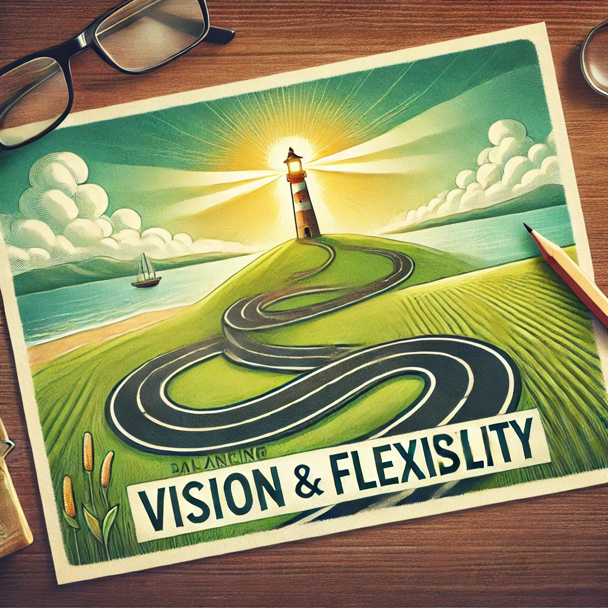

## The Importance of Vision and the Power of Flexibility

Having a clear vision is like having a roadmap for life. It gives us direction, purpose, and a sense of where we are headed. Without a clear vision, it can be difficult to make consistent progress. However, I've also come to understand that being flexible along the way is just as crucial.

A clear vision helps us stay focused on our goals, but it shouldn't become a rigid boundary that limits our growth. Life is unpredictable, and sticking too rigidly to one plan can prevent us from adapting to opportunities that arise. Flexibility means embracing change and being open to different paths, even if they aren't the ones we originally envisioned.

In my journey, I've realized the value of balancing these two aspects—vision and flexibility. A vision provides the destination, but flexibility allows us to explore different ways to get there. It's like navigating a road trip: you know where you want to end up, but sometimes detours and unexpected turns make the journey more rewarding.

This idea resonates with the teachings of Buddhism and Laozi's Taoism. In Buddhism, there is a concept of non-attachment—letting go of rigid expectations and being present in each moment. It teaches us to cultivate an internal state of balance without clinging to specific outcomes. Similarly, Laozi's philosophy encourages us to be like water—flowing naturally, adapting to whatever comes while maintaining our essence. The Taoist principle of wu wei, or effortless action, is about allowing things to unfold naturally without force, creating space for individual freedom.

I've learned that having a clear vision doesn't mean I need to control every step of the journey. Instead, I can embrace the unknown, trust the process, and adapt as I go. Flexibility helps me stay open to new possibilities, while my vision keeps me grounded in purpose.

In the end, life is about finding the balance between knowing where you want to go and being open to how you get there. Maybe, for now, having both vision and flexibility is enough—allowing me to grow, explore, and move toward something meaningful, even if the exact path isn't always clear.

